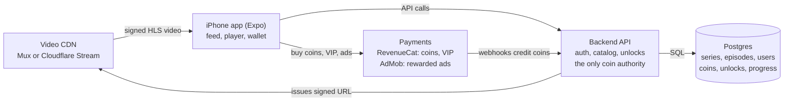

# shortDrama App Plan

As of 2026-09-29 · Live version (comments, edits): https://claude.ai/code/artifact/bba5afd3-3ccd-4dea-9a12-a22e17b413ec

## Summary

shortDrama is a DramaBox-style iPhone app for vertical short-drama series: 60–120 episodes of 1–2 minutes each, watched by swiping up.

- **Built with** Expo (React Native). We test on a real iPhone with Expo Go and build for the App Store in the cloud with EAS, so Xcode isn't needed on the Mac.
- **Revenue:** the first 5–10 episodes of each series are free. After that, viewers unlock episodes with coins bought in-app, a VIP subscription, or by watching rewarded ads.
- **v1 goal:** a working vertical player and series catalog with coin unlocks, on TestFlight.
- **Current state:** the project is scaffolded at `~/projects/shortDrama`.

## How DramaBox-style apps work

These apps sell cliffhangers. Viewers get hooked on free episodes, then pay per episode to keep watching. The patterns below come from general knowledge of DramaBox and ReelShort, not a fresh market check, so treat the numbers as approximate.

| Element | Typical pattern |
| --- | --- |
| Content | Vertical 9:16 series, 60–100+ episodes of 1–2 minutes, each ending on a cliffhanger |
| Genres | Revenge, billionaire romance, werewolf and fantasy, secret identity, family drama |
| Free tier | First 5–10 episodes of each series free |
| Coins | Each later episode costs coins; coins are sold in in-app purchase packs |
| VIP | Weekly or yearly subscription that unlocks everything |
| Rewarded ads | Watch an ad to unlock one episode or earn coins |
| Retention | Daily check-in bonus coins, streaks, push alerts for new episodes, auto-play of the next episode |
| Discovery | A full-screen "For You" feed of trailers and first episodes, plus ranked lists (Trending, New, Top) |

## Screens

Four bottom tabs (For You, Discover, My List, Profile), plus a full-screen player and an unlock sheet.

| Screen | What it does | Version |
| --- | --- | --- |
| For You | Full-screen vertical swipe feed of trailers and episode 1s; tap to open the series | v1 |
| Discover | Banner carousel, genre chips, and Trending, New and Top lists as poster rows | v1 |
| Series detail | Poster, synopsis, tags, episode grid with lock icons, Play button | v1 |
| Player | Full-screen episode player; swipe up for the next episode; episode list drawer; auto-play next | v1 |
| Unlock sheet | Opens on a locked episode: pay coins, watch an ad, or go VIP | v1 (coins), v2 (ads, VIP) |
| My List | Continue watching (with progress) and saved series | v1 |
| Rewards | Daily check-in, streak, earn-coin tasks | v2 |
| Profile and wallet | Coin balance, buy coins, VIP status, purchase history, settings, sign-in | v1 (basic) |

## Tech stack and architecture

Expo for the app, a video CDN for streaming, and a small backend that owns coins and unlocks.

| Layer | Choice | Why |
| --- | --- | --- |
| App | Expo SDK (React Native, TypeScript, expo-router) | Runs on the Mac without Xcode; Android later from the same code |
| Playback | `expo-video` with HLS | Uses Apple's native player; adapts quality to the connection; works in Expo Go |
| Video hosting | Mux or Cloudflare Stream | Converts uploads to HLS, streams from a CDN, signed URLs for locked episodes |
| Backend | Supabase, or Node/Express + Postgres | Supabase is faster to start; Express reuses existing servers |
| Payments | RevenueCat over Apple in-app purchase | Handles coin packs, VIP subscriptions, receipts and webhooks |
| Ads | Google AdMob rewarded ads | Server-side verification callback grants the unlock |
| Builds | EAS Build and TestFlight | iOS builds in the cloud, no Xcode needed |

Locked episodes stay locked on the server. The API only issues a short-lived signed video URL after checking the coin ledger, and purchases are credited by RevenueCat webhooks, never by the app itself. Payments and AdMob need an EAS development build, because they don't run inside Expo Go.

## Monetization and App Store rules

All digital unlocks must go through Apple's in-app purchase, which takes 15–30%. Any web checkout for coins inside the app gets rejected in review.

- **Coin packs** are consumable in-app purchases. Coins live in our server ledger, not on the device, so reinstalling or switching phones never loses them.
- **VIP** is an auto-renewing subscription (weekly and yearly). Apple requires clear price, renewal terms and a Restore Purchases button.
- **Rewarded ads** grant one episode or a few coins, only after AdMob's server-side verification callback.
- **Apple review risks:**
    - Show real content on first launch.
    - Give accurate age ratings for mature themes.
    - Offer account deletion inside the app if sign-in exists.
    - Keep subscription wording clear.
    - Honor App Tracking Transparency before personalized ads.
- **Content rights.** Every series needs a license or has to be our own production. Apple removes apps that stream content they can't show rights for.

## Roadmap and tasks

Four phases. Each ends with a build you can install on your iPhone.

**Phase 0: Setup**

- [x] Create the Expo project at `~/projects/shortDrama` with `expo-video`
- [ ] Create a private GitHub repo and push
- [ ] Create an Expo account and link the project to EAS (`eas init`)
- [ ] Enroll in the Apple Developer Program ($99 a year), needed for TestFlight
- [ ] CI: GitHub Actions for lint and type-check on every push
- [ ] CD: EAS Build on pushes to `main`, then EAS Submit to TestFlight; EAS Update for over-the-air JavaScript fixes

**Phase 1: Player MVP (sample videos, no backend)**

- [ ] For You vertical swipe feed with autoplay and preloading of the next video
- [ ] Series detail with an episode grid
- [ ] Full-screen player: swipe to the next episode, auto-play next, episode drawer
- [ ] My List with continue watching, stored on the device

**Phase 2: Backend and catalog**

- [ ] Choose Supabase or Express, then build the schema: series, episodes, users, coin ledger, unlocks, progress
- [ ] Video hosting (Mux or Cloudflare Stream) and signed playback URLs
- [ ] Sign in with Apple, plus guest mode
- [ ] Admin upload flow for series and episodes

**Phase 3: Monetization and launch**

- [ ] RevenueCat: coin packs and VIP; unlock sheet
- [ ] AdMob rewarded ads with server-side verification
- [ ] Daily check-in and rewards
- [ ] Push notifications for new episodes
- [ ] App Store listing, privacy labels, age rating, then submit

## Open decisions

| Decision | Options | Leaning |
| --- | --- | --- |
| Content source | License existing series, produce our own, or both | Needed before Phase 2; blocks launch |
| Backend | Supabase or Node/Express + Postgres | Supabase for speed, unless we want it on existing servers |
| GitHub repo | Personal account or an org; name `shortDrama` | Private repo |
| Pricing | Episode cost in coins, coin pack prices, VIP price | Set after test content exists |
| Android | Same code; launch with iOS or later | Later, after iOS proves out |
| Brand name | `shortDrama` is a working name | Pick before the App Store listing |
